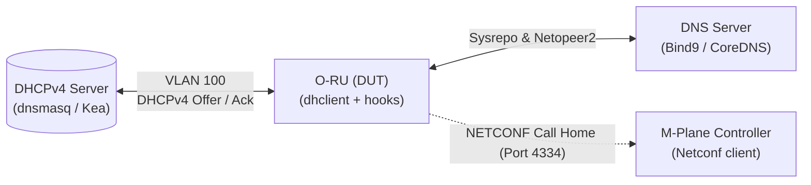

# O-RU DHCPv4 整合測試流程與報告 (Test Procedure and Report)

> [!NOTE]
> 本文件旨在驗證 O-RU 在 DHCPv4 環境下的網路配置與 M-Plane 控制器 Call Home 設定。特別針對 DHCP `BOUND`、`RENEW`、`RELEASE` 等狀態轉換，以及 Option 43 解析、`netopeer2-server` 重啟優化邏輯進行完整測試。

---

## 1. 測試環境與拓撲架構

### 1.1 測試拓撲


### 1.2 測試設備配置
*   **DHCPv4 Server**: 負責發放 IP、Mask、Gateway 與 Option 43 (Vendor-Specific Info)。
*   **O-RU (DUT)**: 執行 `dhclient` 配合 `rfc2132-vendor-specific` exit-hook 與 `/usr/sbin/sr-iface-cfg.py`。
*   **DNS Server**: 負責解析 O-RU Controller 的 FQDN (例如 `oran-ru.pegatron04`)。
	
---

## 2. 測試案例 (Test Cases)

### 2.1 Test Case 1: DHCPv4 基本 IP 與路由配置 (BOUND)
*   **測試目的**：驗證 O-RU 能正常透過 DHCPv4 獲取 IP，並套用至系統與 Sysrepo 數據庫。
*   **測試步驟**：
    1. 啟動 O-RU 的 mplane 介面 DHCPv4 功能。
    2. 使用 DHCPv4 伺服器分配 IP `192.168.100.47`、遮罩 `255.255.248.0`、預設閘道 `192.168.100.125`。
    3. 待租約建立後，檢查本機網路介面與路由表。
    4. 檢查 Sysrepo 中的 `ietf-interfaces` 是否正確更新。
*   **預期結果**：
    *   `ifconfig mplane` 正確顯示 IP 與遮罩（`netmask 255.255.248.0`）。
    *   `ip route` 中有 `default via 192.168.100.125 dev mplane` 的預設路由。
    *   Sysrepo 狀態符合預期：
        ```bash
        sysrepocfg -X -d running -m ietf-interfaces
        # 應包含：ip: "192.168.100.47", prefix-length: 21
        ```
        
        
        
        
        

---

### 2.2 Test Case 2: Option 43 廠商專屬欄位解析與 Call Home 設定
*   **測試目的**：驗證 DHCPv4 Option 43 中的 M-Plane 控制器資訊能正確寫入 Sysrepo。
*   **測試步驟**：
    1. 配置 DHCPv4 Server 發送 Option 43：
       *   Sub-option 129 (IP 地址)：`192.168.100.107`
       *   Sub-option 130 (FQDN)：`oran-ru.pegatron04`
    2. O-RU 端重新索取 IP（觸發 `BOUND`）。
    3. 執行 `/usr/sbin/callhome-cfg.py get mplane_dhcp_v4_ip` 與 `mplane_dhcp_v4_fqdn`。
*   **預期結果**：
    *   Sysrepo 中 Call Home 端點成功新增控制器 IP 與 FQDN，連接埠為預設的 `4334`。
    *   `/tmp/rfc2132-vendor-specific` 中有解析紀錄。
    *	切換fqdn mode至ip mode。
    	
    *	獲取dhcp fqdn。
    	
    *	獲取dhcp ip。
	
---

### 2.3 Test Case 3: DHCP 租約更新與重啟優化 (RENEW / REBIND - 無變更)
*   **測試目的**：驗證當 DHCP 租約更新且設定無任何變動時，系統不會重複重啟 `netopeer2-server`。
*   **測試步驟**：
    1. 觸發 `dhclient` 的 RENEW 流程（例如發送 `SIGHUP` 或等待租約半期）。
    2. 檢查系統日誌 `/var/log/syslog` 及 `/tmp/rfc2132-vendor-specific` 的 RENEW 檢查點。
*   **預期結果**：
    *   日誌輸出：`DHCP RENEW: new configuration is the same as the old configuration. No changes made.`。
    *   `netopeer2-server` 沒有重啟， Call Home 連線保持穩定不中斷。
  		

---

### 2.4 Test Case 4: 控制器或本地網路資訊變更 (RENEW - 有變更)
*   **測試目的**：驗證當更新後的 DHCP 租約中 IP/Mask/Gateway 或 Option 43 與先前不一致時，系統能自動重啟服務。
*   **測試步驟**：
    1. 修改 DHCP Server 端的 Option 43 控制器 FQDN 為 `oran-ru.pegatron06`（或修改 FQDN）。
    2. 觸發 `dhclient` RENEW。
    3. 監控系統日誌與 `netopeer2-server` 狀態。
*   **預期結果**：
    *   系統日誌顯示 `DHCP RENEW: remoteAddr changed ... restarting netopeer2-server`。
    *   `netopeer2-server` 成功重啟以應用新連線。
    *   新的 IP 與 FQDN 寫入 Sysrepo。
    	

---

### 2.5 Test Case 5: FQDN DNS 解析變更與快取更新
*   **測試目的**：驗證當 DNS 中控制器的 FQDN 解析 IP 改變時，系統會更新本地快取並重啟服務，且能持久化快取紀錄。
*   **測試步驟**：
    1. 將 DNS 伺服器中 `oran-ru.pegatron04` 的 A 紀錄從 `192.168.100.107` 修改為 `192.168.100.109`。
    2. 觸發 DHCP RENEW。
    3. 檢查 `/tmp/fqdn_ip_cache_mplane` 內容。
    4. 再次觸發 DHCP RENEW，觀察第二次時是否還會因為 DNS 變更而重複重啟。
*   **預期結果**：
    *   第一次 RENEW 時：日誌顯示 `FQDN DNS IP changed: oran-ru.pegatron04 ... -> 192.168.100.109, restarting netopeer2-server.`。
    *   快取檔 `/tmp/fqdn_ip_cache_mplane` 內容更新為 `192.168.100.109`。
    *   第二次 RENEW 時：`old_resolved` 成功讀取到 `192.168.100.109`，與 `new_resolved` 一致。
    	

---

### 3 關鍵系統日誌佐證 (Log Evidences)

```text
# 第一次 RENEW 成功解析並重啟服務，並將 IP 存入 FQDN_IP_CACHE
[debug] rfc2132-vendor-specific 130 18 111 114 97 110 45 114 117 46 112 101 103 97 116 114 111 110 48 52 in RENEW
DHCP RENEW: RU IP=192.168.100.47, MASK=255.255.248.0, GateWay=192.168.100.125
DHCP RENEW check: old_ip: 192.168.100.107, new_ip: , old_fqdn: , new_fqdn: oran-ru.pegatron04
DHCP RENEW DNS resolve: oran-ru.pegatron04 old_resolved= new_resolved=192.168.100.107
rfc2132-vendor-specific: DHCP RENEW: oruCtrlFqdn changed (old:  -> new: oran-ru.pegatron04), restarting netopeer2-server...

# 第二次 RENEW 時，快取順利被讀取，old_resolved 匹配 new_resolved，無多餘重啟
[debug] rfc2132-vendor-specific 130 18 111 114 97 110 45 114 117 46 112 101 103 97 116 114 111 110 48 52 in RENEW
DHCP RENEW: RU IP=192.168.100.47, MASK=255.255.248.0, GateWay=192.168.100.125
DHCP RENEW check: old_ip: , new_ip: , old_fqdn: oran-ru.pegatron04, new_fqdn: oran-ru.pegatron04
DHCP RENEW DNS resolve: oran-ru.pegatron04 old_resolved=192.168.100.107 new_resolved=192.168.100.107
rfc2132-vendor-specific: DHCP RENEW: new configuration is the same as the old configuration. No changes made.
```
